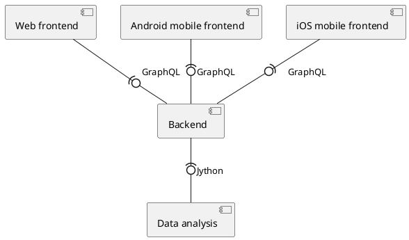
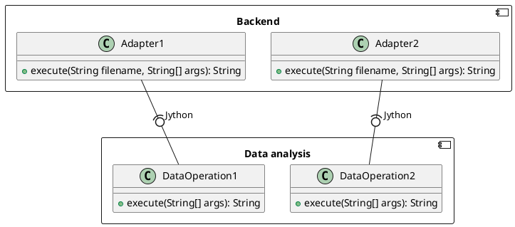

# Components diagram


# Context diagram
```plantuml
@startuml
!include https://raw.githubusercontent.com/plantuml-stdlib/C4-PlantUML/master/C4_Container.puml

LAYOUT_WITH_LEGEND()

Person(users, "Users", "System users")

System(systemAlias, "ADoTO", "Automatic Detection of Topographic Objects System")
System_Ext(geoportal, "Maps data", "BDOT10k & Satellite maps", "API GeoPortal")

Rel(users, systemAlias, "Supplying data", "Data about analyzed objects - maps or coordinates")
Rel(systemAlias, users, "Results", "Object search results, comparisons with GeoPortal")

Rel(systemAlias, geoportal, "Map and building data", "Comparing the data available in the geoportal with those received from the AI module, and providing photomaps")

@enduml
```

# Container diagram
```plantuml
@startuml
!include https://raw.githubusercontent.com/plantuml-stdlib/C4-PlantUML/master/C4_Container.puml

!define DEVICONS2 https://raw.githubusercontent.com/tupadr3/plantuml-icon-font-sprites/master/devicons2
!define FONTAWESOME https://raw.githubusercontent.com/tupadr3/plantuml-icon-font-sprites/master/font-awesome-5
!include DEVICONS2/react_original.puml
!include DEVICONS2/spring.puml
!include DEVICONS2/postgresql.puml
!include DEVICONS2/python.puml
!include FONTAWESOME/users.puml

LAYOUT_WITH_LEGEND()

Person(user, "User", "System users", $sprite="users")

System_Boundary(c1, "ADoTO") {
Container(frontend, "Frontend", "web", "Web interface", $sprite="react_original")
Container(backend, "Backend", "java + spring", "Business logic", $sprite="spring")
Container(dataAnalysis, "Data analysis", "python", "Data analysis module", $sprite="python")
Container(db, "Database service", "PostGIS", "Data storing", $sprite="postgresql")
}
Container_Ext(geoportal, "Maps data API", "BDOT10k & Satellite maps", "API GeoPortal")

Rel(user, frontend, "Uses", "https")
Rel(frontend, backend, "API calls", "rest")
Rel_R(db, backend, "Reads")
Rel_R(backend, db, "Writes")
Rel_L(backend, dataAnalysis, "API calls", "rest")
Rel_R(dataAnalysis, backend, "API calls", "rest")
Rel(backend, geoportal, "API calls", "xml")

@enduml
```

# Component diagram - frontend
```plantuml
@startuml
!include https://raw.githubusercontent.com/plantuml-stdlib/C4-PlantUML/master/C4_Component.puml

!define DEVICONS2 https://raw.githubusercontent.com/tupadr3/plantuml-icon-font-sprites/master/devicons2
!define FONTAWESOME https://raw.githubusercontent.com/tupadr3/plantuml-icon-font-sprites/master/font-awesome-5
!include DEVICONS2/react_original.puml
!include DEVICONS2/spring.puml

LAYOUT_WITH_LEGEND()

Container_Boundary(c1, Frontend) {
Component(fe,"UI elements", "reactjs", "Frontend UI component", "react_original")
Component(febecommunication,"Communication with BE", "axios", "Frontend to backend communication")
}
Container_Boundary(c2, Backend) {
Component_Ext(be,"backend", "spring", "Backend", "spring")
}
Rel(fe, febecommunication, "Uses")
Rel(febecommunication, be, "API calls", "rest")


@enduml
```

# Component diagram - backend
```plantuml
@startuml
!include https://raw.githubusercontent.com/plantuml-stdlib/C4-PlantUML/master/C4_Component.puml

!define DEVICONS2 https://raw.githubusercontent.com/tupadr3/plantuml-icon-font-sprites/master/devicons2
!define FONTAWESOME https://raw.githubusercontent.com/tupadr3/plantuml-icon-font-sprites/master/font-awesome-5
!include DEVICONS2/spring.puml
!include DEVICONS2/flask_original.puml

LAYOUT_WITH_LEGEND()

Container_Boundary(c1, Frontend) {
Component_Ext(febecommunication,"Communication with BE", "axios", "Frontend to backend communication")
}
Container_Boundary(c2, Backend) {
Component(be,"backend", "spring", "Backend", "spring")
Component(beapicommunication,"backend", "spring + jsoup", "Backend to GeoPortal API communication", "spring")
}
Container_Boundary(c3, Data analysis) {
Component_Ext(aibecommunication,"Communication with BE", "flask", "Data analysis module to backend communication", "flask_original")
}
Container_Boundary(c4, Database) {
Component_Ext(dbbecommunication,"Communication with BE", "hibernate", "Database to backend communication")
}
Container_Ext(geoportal, "Maps data API", "BDOT10k & Satellite maps", "API GeoPortal")
Rel(febecommunication, be, "API calls")
Rel(be, beapicommunication, "Uses")
Rel(beapicommunication, geoportal, "API calls")
Rel_L(be, aibecommunication, "API calls")
Rel_R(be, dbbecommunication, "Uses")


@enduml
```

# Component diagram - data analysis
```plantuml
@startuml
!include https://raw.githubusercontent.com/plantuml-stdlib/C4-PlantUML/master/C4_Component.puml

!define DEVICONS2 https://raw.githubusercontent.com/tupadr3/plantuml-icon-font-sprites/master/devicons2
!define FONTAWESOME https://raw.githubusercontent.com/tupadr3/plantuml-icon-font-sprites/master/font-awesome-5
!include DEVICONS2/spring.puml
!include DEVICONS2/flask_original.puml
!include DEVICONS2/python.puml

LAYOUT_WITH_LEGEND()

Container_Boundary(c2, Backend) {
Component_Ext(be,"backend", "spring", "Backend", "spring")
}
Container_Boundary(c3, Data analysis) {
Component(aibecommunication,"Communication with BE", "flask", "Data analysis module to backend communication", "flask_original")
Component(ai,"Data analysis module", "python", "Data analysis module / AI module", "python")
}
Rel_L(be, aibecommunication, "API Calls")
Rel_L(aibecommunication, ai, "Uses")
Rel_R(aibecommunication,be, "API Calls")
Rel_R(ai, aibecommunication, "Uses")


@enduml
```

# Component diagram - database
```plantuml
@startuml
!include https://raw.githubusercontent.com/plantuml-stdlib/C4-PlantUML/master/C4_Component.puml

!define DEVICONS2 https://raw.githubusercontent.com/tupadr3/plantuml-icon-font-sprites/master/devicons2
!define FONTAWESOME https://raw.githubusercontent.com/tupadr3/plantuml-icon-font-sprites/master/font-awesome-5
!include DEVICONS2/spring.puml
!include DEVICONS2/flask_original.puml
!include DEVICONS2/python.puml
!include DEVICONS2/postgresql.puml

LAYOUT_WITH_LEGEND()

Container_Boundary(c2, Backend) {
Component_Ext(be,"backend", "spring", "Backend")
}
Container_Boundary(c4, Database service) {
Component(dbbecommunication,"Communication with BE", "hibernate", "Database to backend communication")
ComponentDb(db,"Database", "postGIS", "Database - PostGIS","postgresql")
}
Rel_R(be, dbbecommunication, "Uses")
Rel_R(dbbecommunication, db, "Uses")


@enduml
```

# Adapter for communication with data analysis module
