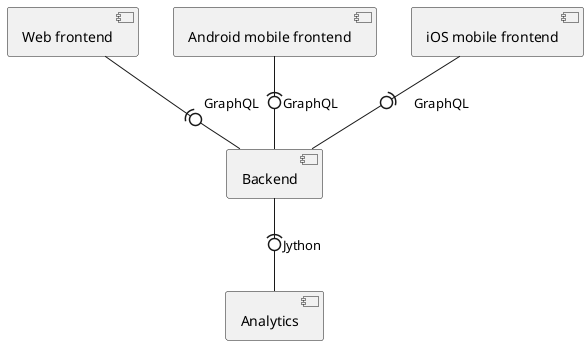

# Components diagram

```plantuml
@startuml
component "Web frontend" as web
component "Android mobile frontend" as android
component "iOS mobile frontend" as ios

component "Backend" as backend

component "Analytics" as analytics

web -(0- backend: GraphQL
android -(0- backend: GraphQL
ios -(0- backend: GraphQL

backend -(0- analytics: Jython

@enduml
```