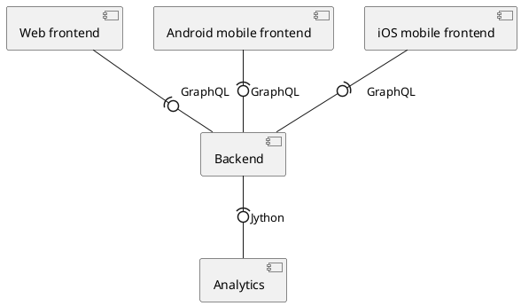

# Components diagram


# Context diagram
```plantuml
@startuml
!include https://raw.githubusercontent.com/plantuml-stdlib/C4-PlantUML/master/C4_Container.puml

!define DEVICONS2 https://raw.githubusercontent.com/tupadr3/plantuml-icon-font-sprites/master/devicons2
!define FONTAWESOME https://raw.githubusercontent.com/tupadr3/plantuml-icon-font-sprites/master/font-awesome-5
!include DEVICONS2/chrome.puml
!include DEVICONS2/spring.puml
!include DEVICONS2/postgresql.puml
!include DEVICONS2/kotlin.puml
!include DEVICONS2/swift.puml
!include DEVICONS2/python.puml
!include FONTAWESOME/users.puml

LAYOUT_WITH_LEGEND()

Person(user, "User", "System users", $sprite="users")

System_Boundary(c1, "Project") {
Container(frontend, "frontend", "web", "Web interface", $sprite="chrome")
Container(frontendAndroid, "frontend", "android", "Android interface", $sprite="kotlin")
Container(frontendIos, "frontend", "ios", "Ios interface", $sprite="swift")
Container(api, "API", "java + spring", "Business logic", $sprite="spring")
Container(dataAnalysis, "Data analysis", "python", "Data analysis module", $sprite="python")
ContainerDb(db, "Database", "PostGIS", "Data storing", $sprite="postgresql")
}

Rel(user, frontend, "Uses", "https")
Rel(user, frontendAndroid, "Uses", "https")
Rel(user, frontendIos, "Uses", "https")
Rel(frontend, api, "API calls", "graphql")
Rel(frontendAndroid, api, "API calls", "graphql")
Rel(frontendIos, api, "API calls", "graphql")
Rel_R(db, api, "Reads")
Rel_R(api, db, "Writes")
Rel(api, dataAnalysis, "Jython")

@enduml
```