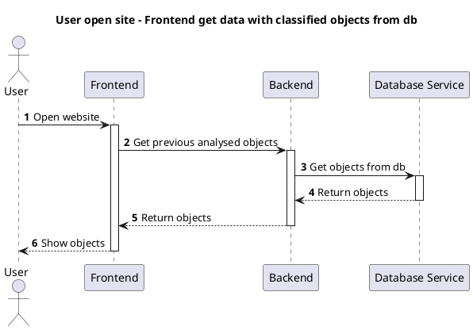
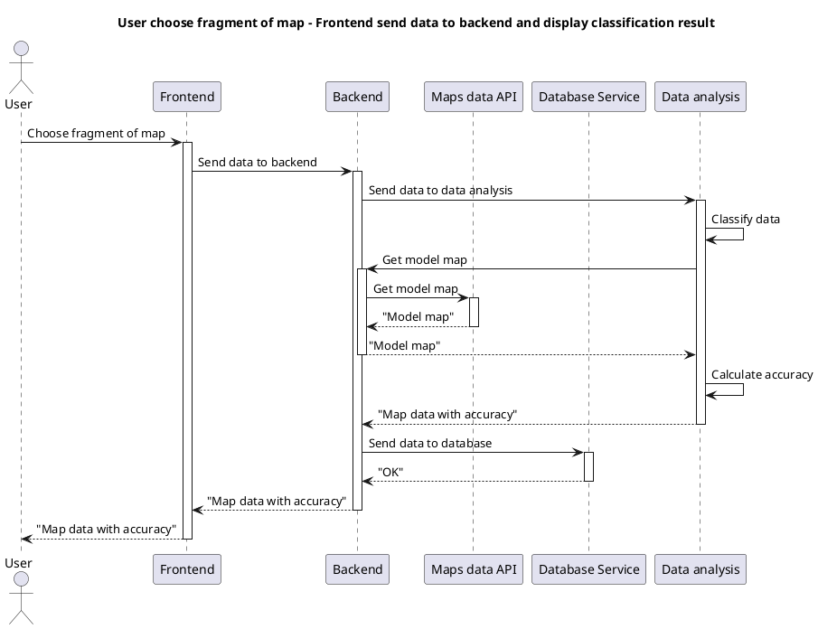

# User open site - Frontend get data with classified objects from db

```plantuml
@startuml

title User open site - Frontend get data with classified objects from db
autonumber

actor User as user
participant "Frontend" as frontend
participant "Backend" as backend
participant "Database Service" as db

user -> frontend : Open website
activate frontend

frontend -> backend : Get previous analysed objects
activate backend
backend -> db : Get objects from db
activate db
return Return objects
return Return objects
return Show objects

@enduml
```
# User choose fragment of map - Frontend send data to backend and display classification result

```plantuml
@startuml
title User choose fragment of map - Frontend send data to backend and display classification result

actor User as user
participant "Frontend" as frontend
participant "Backend" as backend
participant "Maps data API" as geoportal
participant "Database Service" as db
participant "Data analysis" as dataAnalysis

user -> frontend : Choose fragment of map
activate frontend

frontend -> backend : Send data to backend
activate backend
backend -> dataAnalysis : Send data to data analysis
activate dataAnalysis
dataAnalysis -> dataAnalysis : Classify data
dataAnalysis -> backend : Get model map
activate backend
backend -> geoportal : Get model map
activate geoportal
return "Model map"
return "Model map"
dataAnalysis -> dataAnalysis : Calculate accuracy
return "Map data with accuracy"
backend -> db : Send data to database
activate db
return "OK"
return "Map data with accuracy"
return "Map data with accuracy"

@enduml
```